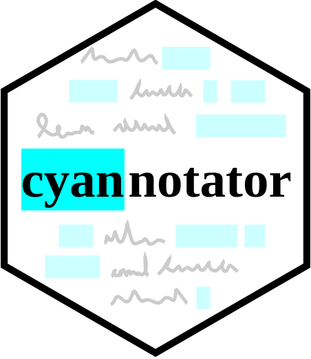

# cyan

Introducing cyan-notate! An annotator for plain text files using a list of words.

Please **note**: as I am not an expert, the script may not work as expected. 

Author __Samantha C Pendleton__, [Twitter](https://twitter.com/sap218) & [GitHub](https://github.com/sap218) | **Python v3.5**

## Installation

**Prerequisite**

`$ sudo pip3 install re`

**GitClone**

`$ git clone https://github.com/sap218/cyan.git`

**Set Up**

`$ cd cyan`
`$ sudo python3 setup.py install` 

## Running**

`$ cyan -file text.txt -words words.txt`

**Running the example**

`$ cd cyan`
`$ cd cyannotator`
`$ cyan -file test_text.txt -words test_words.txt`

## Thank you! :abcd:

Don't hesitate to create an issue or make a suggestion!

###### Todo List
- [x] Set-up repository
- [ ] Improve code
